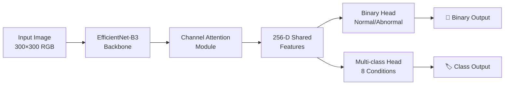

# 🩺 AI-Powered Endoscopic Abnormality Detection  
**Multi-task EfficientNet-B3 for GI Endoscopy Screening - AI700 Final Project**

<div align="center">


**A multi-task deep learning system for real-time gastrointestinal abnormality detection from endoscopic images**

[](https://colab.research.google.com/github/AI700-Final-Project-2025/esophageal-abnormality-detection/blob/main/Group_3_AI700_001_12_Dec_Fall2025.ipynb)
[](https://datasets.simula.no/hyperkvasir/)

*"Better detection today means better outcomes tomorrow."*
</div>

## 📌 Table of Contents
- [🎯 Project Overview](#-project-overview)
- [📊 Key Results](#-key-results-at-a-glance)
- [📁 Repository Structure](#-repository-structure)
- [🚀 Quick Start Guide](#-quick-start-guide)
  - [Option A: Google Colab (Recommended)](#option-a-google-colab-recommended)
  - [Option B: Local Installation](#option-b-local-installation)
- [🔧 Detailed Setup Instructions](#-detailed-setup-instructions)
- [🧠 Model Architecture](#-model-architecture)
- [📈 Performance & Results](#-performance--results)
- [👥 Team & Contributions](#-team--contributions)
- [⚠️ Important Medical Disclaimer](#️-important-medical-disclaimer)
- [🔬 Research Context](#-research-context)
- [📄 License](#-license)
- [📞 Contact](#-contact)

---

## 🎯 Project Overview

This project implements a **multi-task deep learning model** designed to assist medical professionals in the early detection of gastrointestinal (GI) abnormalities from endoscopic images. By analyzing individual frames from endoscopic procedures, the system acts as an **intelligent screening assistant** that can quickly identify potential issues requiring closer examination.

### 🤔 The Problem
Manual review of endoscopic footage is:
- ⏳ **Time-consuming** - Doctors must examine hundreds or thousands of frames
- 👁️ **Prone to fatigue** - Subtle abnormalities can be missed, especially during long procedures
- 🔀 **Subject to variability** - Different clinicians may interpret the same image differently

### ✨ Our Solution
A single AI model that performs **two critical tasks simultaneously**:
1. **📊 Binary Screening**: Classifies images as `Normal` or `Abnormal` mucosa
2. **🏷️ Condition Identification**: If abnormal, identifies the specific GI condition from 8 categories

**Key Innovation**: Unlike most medical AI systems that focus on segmentation (outlining specific areas), our system performs classification (categorizing whole images), which better aligns with how doctors initially screen images during procedures.

---

## 📊 Key Results at a Glance

| Task | Metric | Performance | Clinical Significance |
|------|--------|-------------|----------------------|
| **Binary Classification** | Accuracy | **95.44%** | Highly reliable screening |
| | Sensitivity | **95.50%** | Excellent at catching abnormalities |
| | Specificity | **95.40%** | Good at identifying normal tissue |
| | AUC-ROC | **0.9911** | Excellent discrimination ability |
| **Multi-Class Classification** | Accuracy | **93.94%** | Precise condition identification |
| | Macro-F1 Score | **94.0%** | Balanced performance across all conditions |
| | Cohen's κ | **0.9307** | Strong agreement with expert labels |
| **Inference Speed** | Frames Per Second | **~13.23 FPS** | Near real-time for clinical use |
| | Latency | **75.6 ms** | Fast enough for live procedure support |

---

## 📁 Repository Structure

```
esophageal-abnormality-detection/
├── Group_3_AI700_001_12_Dec_Fall2025.ipynb  # 🚀 MAIN PROJECT NOTEBOOK (Everything in one file)
├── README.md                                 # This documentation file
└── LICENSE                                   # MIT License file
```

**Note**: This is a streamlined repository with everything contained in a single Jupyter Notebook. This approach ensures:
- ✅ Easy to understand and follow
- ✅ No complex file dependencies
- ✅ Perfect for educational and demonstration purposes
- ✅ Easy to run in cloud environments like Google Colab

---

## 🚀 Quick Start Guide

Get up and running with our endoscopic AI system in minutes!

### Option A: Google Colab (Recommended for First-Time Users)

This is the **easiest and fastest** way to explore our project:

1. **Click the Colab badge** at the top of this README, or go directly to:
   ```
   https://colab.research.google.com/github/AI700-Final-Project-2025/esophageal-abnormality-detection/blob/main/Group_3_AI700_001_12_Dec_Fall2025.ipynb
   ```

2. **Sign in** with your Google account (if prompted)

3. **Select a GPU runtime** for faster processing:
   - Go to `Runtime` → `Change runtime type`
   - Select `GPU` as the Hardware accelerator
   - Click `Save`

4. **Run the notebook cells sequentially** by clicking the play buttons ▶️

### Option B: Local Installation

If you prefer to run the project on your own machine:

#### Prerequisites
- **Python 3.8+**
- **8GB+ RAM** (16GB recommended)
- **NVIDIA GPU** (optional but recommended for training)
- **10GB+ free disk space** for the dataset

#### Installation Steps

```bash
# 1. Clone the repository
git clone https://github.com/AI700-Final-Project-2025/esophageal-abnormality-detection.git

# 2. Navigate to the project folder
cd esophageal-abnormality-detection

# 3. Create and activate a virtual environment (recommended)
python -m venv venv

# On Windows:
venv\Scripts\activate

# On macOS/Linux:
source venv/bin/activate

# 4. Install PyTorch with CUDA support (if you have an NVIDIA GPU)
# Visit https://pytorch.org/get-started/locally/ for the correct command for your system
# Example for CUDA 11.8:
pip install torch torchvision torchaudio --index-url https://download.pytorch.org/whl/cu118

# 5. Install additional requirements
pip install numpy pandas matplotlib seaborn scikit-learn tqdm jupyter notebook ipywidgets
```

#### Running the Notebook Locally

```bash
# 6. Launch Jupyter Notebook
jupyter notebook

# 7. In your browser, open 'Group_3_AI700_001_12_Dec_Fall2025.ipynb'
# 8. Run all cells sequentially (Cell → Run All)
```

---

## 🔧 Detailed Setup Instructions

### Dataset Preparation

Our model is trained on the **HyperKvasir 2020** dataset. Here's how to set it up:

1. **Download the dataset** from the official source:
   - URL: https://datasets.simula.no/hyperkvasir/
   - You need to create an account and agree to the terms of use
   - Download the "HyperKvasir: Images" file (approximately 2.3 GB)

2. **Extract and organize the data**:
   ```bash
   # Create a data directory in your project folder
   mkdir -p data/hyperkvasir
   
   # Extract the downloaded archive to this folder
   # The notebook expects the following structure:
   # data/hyperkvasir/
   # ├── dyed-lifted-polyps/
   # ├── dyed-resection-margins/
   # ├── esophagitis/
   # ├── normal-cecum/
   # ├── normal-pylorus/
   # ├── normal-z-line/
   # ├── polyps/
   # └── ulcerative-colitis/
   ```

3. **Update the notebook path**:
   - In the notebook, locate the cell that sets `DATA_DIR`
   - Update it to point to your local dataset path:
   ```python
   DATA_DIR = "Group-3/kvasir-dataset-v2.zip"  
   ```

### Understanding the Notebook Sections

The main notebook is organized into logical sections:

1. **📦 Setup & Imports** - Installs and imports all necessary libraries
2. **📊 Data Loading & Exploration** - Loads the HyperKvasir dataset and shows statistics
3. **🛠️ Data Preprocessing** - Applies transformations and creates data loaders
4. **🧠 Model Architecture** - Defines the multi-task EfficientNet-B3 with attention
5. **⚙️ Training Configuration** - Sets up loss functions, optimizer, and training parameters
6. **🏋️ Training Loop** - Trains the model with progress tracking
7. **📈 Evaluation** - Tests the model and generates performance metrics
8. **👁️ Visualization** - Creates Grad-CAM heatmaps, confusion matrices, and t-SNE plots
9. **⚡ Inference Demo** - Shows how to use the trained model on new images

### Common Issues & Troubleshooting

| Issue | Solution |
|-------|----------|
| **"ModuleNotFoundError"** | Run the first notebook cell to install all dependencies |
| **Out of memory errors** | Reduce batch size in the training configuration |
| **Slow training** | Ensure you're using GPU runtime (Colab) or have CUDA installed locally |
| **Dataset not found** | Verify the DATA_DIR path points to your extracted HyperKvasir folder |
| **Kernel keeps restarting** | Check memory usage; try reducing image size or batch size |

---

## 🧠 Model Architecture

Our system uses a sophisticated yet efficient architecture:

### Core Components



### Technical Details

1. **Backbone Network**: **EfficientNet-B3** pre-trained on ImageNet
   - Why EfficientNet? It provides optimal accuracy-efficiency tradeoff
   - B3 variant chosen as lighter models (B0-B2) lack capacity, while heavier ones (B4-B7) offer diminishing returns

2. **Attention Module**: Custom lightweight **channel-attention mechanism**
   - Inspired by medical attention architectures
   - Helps model focus on clinically relevant regions
   - Adds minimal computational overhead

3. **Multi-Task Design**: Single backbone with two specialized heads
   - **Binary Head**: 1 output neuron with sigmoid activation
   - **Multi-Class Head**: 8 output neurons with softmax activation
   - **Shared Features**: 256-dimensional embedding layer

4. **Training Strategy**:
   - **Loss Function**: Combined loss `L_total = L_binary + 0.5 * L_multi`
     - Binary loss: Class-weighted cross-entropy
     - Multi-class loss: Focal loss (γ=2.0) to handle class imbalance
   - **Optimizer**: AdamW with learning rate 1e-4
   - **Scheduler**: Cosine annealing learning rate decay
   - **Regularization**: Early stopping, dropout, and extensive data augmentation

---

## 📈 Performance & Results

### Binary Classification Performance

| Metric | Value | Interpretation |
|--------|-------|----------------|
| **Accuracy** | 95.44% | Overall correct predictions |
| **Sensitivity (Recall)** | 95.50% | Excellent at detecting abnormalities |
| **Specificity** | 95.40% | Excellent at identifying normal tissue |
| **Precision** | 92.64% | When it flags abnormal, it's usually correct |
| **F1-Score** | 94.01% | Balanced performance metric |
| **ROC-AUC** | 0.9911 | Near-perfect discrimination ability |
| **PR-AUC** | 0.9869 | Strong performance at relevant thresholds |

### Multi-Class Performance by Condition

| Condition | F1 Score | Samples | Notes |
|-----------|----------|---------|-------|
| dyed-lifted-polyps | 94.5% | 189 | High accuracy |
| dyed-resection-margins | 95.1% | 213 | High accuracy |
| esophagitis | 85.7% | 191 | Challenging due to visual overlap |
| normal-cecum | 97.7% | 203 | Excellent performance |
| normal-pylorus | 99.5% | 191 | Near perfect |
| normal-z-line | 85.4% | 204 | Similar appearance to other normals |
| polyps | 96.7% | 217 | High accuracy |
| ulcerative-colitis | 96.7% | 192 | High accuracy |

### Visual Interpretability

One of our key contributions is **model interpretability**:

1. **Grad-CAM Heatmaps**: Visual explanations showing which image regions influenced the model's decision
   - For abnormal cases: Highlights lesion regions, inflamed mucosa, polyp masses
   - For normal cases: Shows diffuse, non-focused activations

2. **t-SNE Visualizations**: 2D plots of the 256-dimensional feature space
   - Clear separation between Normal and Abnormal clusters
   - Distinct groupings for each condition class
   - Visually similar classes appear closer in the embedding space

3. **Confusion Matrices**: Detailed error analysis showing which classes are most commonly confused

### Speed & Efficiency

- **Inference Speed**: 75.6 ms per image (13.23 FPS) on a single NVIDIA GPU
- **Optimization Potential**: With mixed-precision inference and TensorRT, can reach 25-30 FPS
- **Model Size**: ~13.2 million parameters
- **Memory Usage**: ~2.5 GB GPU memory during training with batch size 16

---

## 👥 Team & Contributions

| Team Member | Role | Key Contributions |
|-------------|------|-------------------|
| **Rupali Ravindra Shetye** | Model Architecture & Literature Review | - Designed the multi-task EfficientNet-B3 architecture with channel attention<br>- Conducted comprehensive literature review on GI endoscopy CAD systems<br>- Drafted methodology and background sections of the report |
| **Akila Lourdes Miriyala Francis** | Technical Implementation & Core Code | - Implemented the complete PyTorch pipeline (~1,500 lines)<br>- Built attention module, loss functions, and training loop<br>- Integrated data augmentation and learning rate scheduling |
| **Akilan Manivannan** | Data Acquisition & Experimental Management | - Curated the HyperKvasir subset and created stratified splits<br>- Managed experimental runs, hyperparameters, and checkpoints<br>- Conducted real-time inference benchmarking |
| **Amisha Patel** | Data Preprocessing, Evaluation & Visualization | - Developed preprocessing pipelines for all data splits<br>- Generated classification reports, confusion matrices, and metrics<br>- Created t-SNE and Grad-CAM visualizations |

**Course**: AI700-001, Fall 2025  
**Institution**: Long Island University, Department of Artificial Intelligence  
**Project Duration**: October - December 2025

---

## ⚠️ Important Medical Disclaimer

<div align="center" style="background-color: #fff3cd; padding: 20px; border-radius: 10px; border-left: 5px solid #ffc107; margin: 25px 0;">

### ⚠️ CRITICAL MEDICAL DISCLAIMER

**This is a research prototype developed for academic purposes.**

#### ❌ NOT FOR DIAGNOSTIC USE
- This system is **NOT** a clinically validated medical device
- It is **NOT** approved for diagnostic use by regulatory authorities
- It should **NOT** be used for direct patient diagnosis or treatment decisions

#### ✅ INTENDED USE
- As a **research tool** for academic investigation
- As a **screening aid** to help prioritize cases for review
- As an **educational tool** for demonstrating AI applications in medicine
- As a **second-reader system** to be used alongside clinician expertise

#### 🔒 CLINICAL RESPONSIBILITY
- **All clinical decisions must be made by qualified healthcare professionals**
- This tool is designed to **assist**, not replace, medical experts
- **False negatives and false positives are possible** - clinical oversight is essential
- **External validation** across multiple medical centers is required before any clinical consideration

*Always consult with qualified medical professionals for diagnosis and treatment.*
</div>

---

## 🔬 Research Context

### Comparison with Existing Approaches

| Aspect | Medical Transformer (MedT) | Our System |
|--------|----------------------------|------------|
| **Primary Task** | Medical image segmentation | Multi-task classification |
| **Backbone** | Gated axial-attention transformer | EfficientNet-B3 + channel attention |
| **Output** | Pixel-level masks | Image-level labels |
| **Data Efficiency** | Requires careful tuning on small datasets | Leverages ImageNet pretraining + HyperKvasir |
| **Interpretability** | Segmentation masks | Grad-CAM, t-SNE, ROC curves |
| **Real-Time Capability** | Not optimized | ~13 FPS (optimizable to 25-30 FPS) |
| **Clinical Workflow Fit** | Offline analysis | Potential for live procedure support |

### Key Innovations

1. **Multi-Task Efficiency**: Single model performs both screening and classification
2. **Attention Mechanism**: Lightweight module that improves focus on relevant regions without heavy computational cost
3. **Clinical Workflow Alignment**: Design mirrors how gastroenterologists work (screen first, then classify)
4. **Speed-Accuracy Balance**: Chose EfficientNet-B3 as the optimal point on the accuracy-efficiency curve
5. **Explainability Focus**: Built-in visualization tools (Grad-CAM, t-SNE) for clinician trust and verification

### Limitations & Future Work

#### Current Limitations
- Trained only on HyperKvasir dataset (needs multi-center external validation)
- Frame-level analysis only (no temporal modeling from video)
- Limited to 8 specific conditions (does not cover all GI abnormalities)
- Not validated for cancer staging or dysplasia grading

#### Future Research Directions
1. **Video-based Analysis**: Extend to temporal modeling using 3D CNNs or transformers
2. **External Validation**: Test on diverse, multi-center clinical datasets
3. **Ablation Studies**: Quantify contributions of attention module and multi-task design
4. **Deployment Optimization**: Model compression, quantization, hardware acceleration
5. **Clinical Trials**: Prospective studies to assess real-world impact and usability

---

## 📄 License

This project is licensed under the **MIT License** - see the [LICENSE](LICENSE) file for full details.

### Summary of MIT License Terms:
- ✅ **Free to use** for personal, academic, and commercial purposes
- ✅ **Freedom to modify** and distribute the code
- ✅ **No warranty** provided - use at your own risk
- ✅ **Must include original copyright notice** in all copies or substantial portions

### For Commercial & Clinical Use
While the code is open-source under MIT:
- Additional **clinical validation** is required for medical use
- **Regulatory approvals** (FDA, CE, etc.) would be necessary for diagnostic applications
- **Consult legal counsel** before deploying in clinical settings

---

## 📞 Contact & Support

### Project Lead
**Rupali Ravindra Shetye**  
Department of Artificial Intelligence  
Long Island University, Brooklyn, USA  
Email: rupaliravindra.shetye@my.liu.edu

### Course Information
**Course**: AI700-001 - Applicable Deep Learning 
**Semester**: Fall 2025  
**Institution**: Long Island University  
**Instructor**: Reda Nacif El Alaoui


### Acknowledgments

We extend our sincere gratitude to:

- **Long Island University Faculty & Staff** for guidance and computational resources
- **HyperKvasir Dataset Team** for creating and maintaining this valuable resource
- **Open Source Community** for the incredible tools and libraries that made this work possible
- **Medical Professionals** who inspire work at the intersection of AI and healthcare

---

<div align="center">

## 🔬 Research | 🤖 AI | 🏥 Medicine | 💝 Impact

*"Enhancing early detection for better patient outcomes through ethical AI innovation"*

📅 **Last Updated**: December 2025  
🔗 **Repository**: https://github.com/AI700-Final-Project-2025/esophageal-abnormality-detection

**[⬆ Back to Top](#-ai-powered-endoscopic-abnormality-detection)**

</div>

---

*This README was last updated on December 10, 2025. For the most current information, always refer to the latest commit in the repository.*
